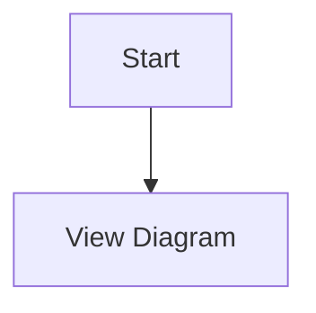

# CLAUDE.md

This file provides guidance to Claude Code (claude.ai/code) when working with code in this repository.

## Quick Start Commands

### Development Workflow
```bash
# Install dependencies
just install
# or
pnpm install

# Watch mode for development (runs both TypeScript compiler and esbuild)
just
# or
pnpm run watch

# Build for production
just build
# or
pnpm run package

# Lint and type check
just lint
# or
pnpm run lint && pnpm run check-types

# Run tests (not yet implemented)
just test
# or
pnpm run test

# Package extension as VSIX file
just package-vsix
```

### VS Code Development
- Press `F5` in VS Code to run the extension in debug mode
- Use "Run Extension" launch configuration in `.vscode/launch.json`
- Pre-launch task builds the extension automatically

## Architecture Overview

This is a **VS Code extension** that provides Mermaid diagram preview functionality. The extension is built with TypeScript and uses esbuild for bundling.

### Core Components

1. **extension.ts** (`src/extension.ts:8`) - Main entry point
   - Registers all commands and providers
   - Handles activation/deactivation
   - Manages CodeLens provider lifecycle with debounced refresh

2. **PreviewPanel** (`src/previewPanel.ts:28`) - Dedicated preview panel
   - Creates and manages webview panel for `.mmd` and `.mermaid` files
   - Supports configurable panel positioning (beside, left, right, etc.)
   - Handles MermaidChart file navigation links
   - Auto-updates when active editor changes to a Mermaid file

3. **InlinePreviewManager** (`src/inlinePreviewManager.ts`) - Inline preview for Markdown
   - Manages inline previews within Markdown files
   - Singleton pattern for state management
   - Allows toggling preview on/off

4. **MermaidChartCodeLensProvider** (`src/mermaidChartCodeLensProvider.ts:1`) - CodeLens integration
   - Detects `MermaidChart:` links in any file type
   - Provides "Preview" and "Open File" actions via CodeLens
   - Supports HTML link format: `<a href="MermaidChart:path/to/file.mmd">Link Text</a>`
   - Includes debounced refresh for performance

### Build System

- **TypeScript**: Type checking (`tsconfig.json`)
- **esbuild**: Bundling (`esbuild.js`) - watches `src/extension.ts` and outputs to `dist/extension.js`
- **ESLint**: Linting (`eslint.config.mjs`)
- **Just**: Task runner (`justfile`) - provides convenient command shortcuts

### Language Support

- **Mermaid**: Full syntax highlighting via `syntaxes/mermaid.tmLanguage.json`
- **File Extensions**: `.mmd`, `.mermaid`
- **Activation**: On commands, on language detection, or on file open

## Key Features

### Commands
- `mermaid.preview` - Open dedicated preview panel (Ctrl+Shift+V in Mermaid files)
- `mermaid.previewInline` - Toggle inline preview in Markdown files
- `mermaidChart.preview` - Preview via CodeLens link
- `mermaidChart.openFile` - Open file via CodeLens link
- `mermaidChart.refreshCodeLens` - Manually refresh CodeLens

### Configuration Options
- `merfolk.preview.defaultColumn` - Where to open preview panel (beside/right/left/active/one/two/three)
- `merfolk.inlinePreview.defaultColumn` - Where to open inline previews

### MermaidChart Links
The extension supports special `MermaidChart:` links for cross-file navigation:


## Testing & CI/CD

### GitHub Actions
- **test.yml**: Runs on push/PR to main
  - Node.js 18
  - Installs dependencies via pnpm
  - Runs linting and type checking

- **release.yml**: Triggered by version tags (v*.*.*)
  - Builds extension
  - Packages as VSIX
  - Creates GitHub release with VSIX attachment

### Development Testing
```bash
# Compile tests (when implemented)
pnpm run compile-tests

# Run tests (when implemented)
pnpm run test
```

## Project Structure

```
vscode-merfolk/
├── src/                    # Source code
│   ├── extension.ts        # Main entry point
│   ├── previewPanel.ts     # Dedicated preview panel
│   ├── inlinePreviewManager.ts  # Inline preview management
│   ├── mermaidChartCodeLensProvider.ts  # CodeLens provider
│   └── test/              # Test files (not implemented)
├── examples/              # Mermaid diagram examples
│   ├── basic/             # Basic diagrams
│   ├── advanced/          # Advanced diagrams
│   ├── workflow/          # Workflow diagrams with MermaidChart links
│   └── architecture/      # System architecture diagrams
├── assets/                # Static assets for webviews
├── syntaxes/              # Mermaid syntax highlighting
├── dist/                  # Built extension (generated)
├── justfile               # Task runner commands
├── esbuild.js            # Bundler configuration
├── package.json          # Dependencies and scripts
└── tsconfig.json         # TypeScript configuration
```

## Common Development Tasks

### Adding a New Command
1. Register command in `extension.ts:12-151`
2. Implement command handler
3. Add to context subscriptions

### Modifying Preview Behavior
- Panel positioning logic: `previewPanel.ts:4-26`
- Webview content updates: `previewPanel.ts:82+`
- Message handling: `previewPanel.ts:96+`

### Working with MermaidChart Links
- Detection logic: `mermaidChartCodeLensProvider.ts`
- Link format: `MermaidChart:path/to/file.mmd`
- CodeLens refresh: `extension.ts:76-126`

## Notes

- Uses **pnpm** as package manager (not npm/yarn)
- **esbuild** for bundling (not webpack/rollup)
- Extension runs on VS Code Engine ^1.106.1
- Tests are currently not implemented
- Examples directory contains extensive Mermaid diagram samples with MermaidChart link demonstrations
