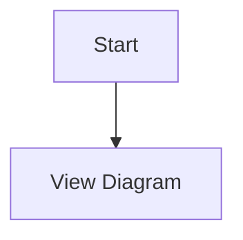

# CLAUDE.md

This file provides guidance to Claude Code (claude.ai/code) when working with code in this repository.

## Quick Start Commands

### Development Workflow
```bash
# Install dependencies
just install
# or
pnpm install

# Watch mode for development (runs both TypeScript compiler and esbuild)
just
# or
pnpm run watch

# Build for production
just build
# or
pnpm run package

# Lint and type check
just lint
# or
pnpm run lint && pnpm run check-types

# Run tests (not yet implemented)
just test
# or
pnpm run test

# Package extension as VSIX file
just package-vsix
```

### VS Code Development
- Press `F5` in VS Code to run the extension in debug mode
- Use "Run Extension" launch configuration in `.vscode/launch.json`
- Pre-launch task builds the extension automatically

## Architecture Overview

This is a **VS Code extension** that provides Mermaid diagram preview functionality. The extension is built with TypeScript and uses esbuild for bundling.

### Core Components

1. **extension.ts** (`src/extension.ts:21`) - Main entry point
   - Creates and configures IoC container
   - Registers all services and providers
   - Handles activation/deactivation lifecycle
   - Disposes all services on deactivation

2. **DIContainer** (`src/core/container.ts:7`) - IoC container
   - Manages dependency injection
   - Registers singleton services
   - Handles service resolution and lifecycle

3. **Services Layer** - Feature implementations
   - **PreviewService** (`src/services/previewService.ts:10`) - Manages preview panels
   - **CodeLensService** (`src/services/codeLensService.ts:9`) - Handles CodeLens provider registration
   - **FileService** (`src/services/fileService.ts:9`) - File path resolution and operations
   - **ConfigService** (`src/services/configService.ts:9`) - Configuration management

4. **Providers Layer** - VS Code integration
   - **ActivationProvider** (`src/providers/activationProvider.ts:8`) - Handles extension activation
   - **CommandProvider** (`src/providers/commandProvider.ts:9`) - Registers all commands

5. **UI Components** - User interface
   - **PreviewPanel** (`src/ui/preview/previewPanel.ts:5`) - Dedicated preview panel with webview
   - Supports zoom, pan, and export functionality
   - Auto-updates on document changes with debouncing

6. **MermaidChartCodeLensProvider** (`src/core/service.ts:141`) - CodeLens integration
   - Detects `[MermaidChart: path]` patterns in any file
   - Provides "Preview" and "Open" actions via CodeLens
   - Includes performance optimizations (caching, debouncing)

### Build System

- **TypeScript**: Type checking (`tsconfig.json`)
- **esbuild**: Bundling (`esbuild.js`) - watches `src/extension.ts` and outputs to `dist/extension.js`
- **ESLint**: Linting (`eslint.config.mjs`)
- **Just**: Task runner (`justfile`) - provides convenient command shortcuts

### Language Support

- **Mermaid**: Full syntax highlighting via `syntaxes/mermaid.tmLanguage.json`
- **File Extensions**: `.mmd`, `.mermaid`
- **Activation**: On commands, on language detection, or on file open

## Key Features

### Commands
- `mermaid.preview` - Open dedicated preview panel (Ctrl+Shift+V in Mermaid files)
- `mermaidChart.preview` - Preview via CodeLens link
- `mermaidChart.openFile` - Open file via CodeLens link
- `mermaidChart.refreshCodeLens` - Manually refresh CodeLens

### Configuration Options
- `merfolk.preview.defaultColumn` - Where to open preview panel (beside/right/left/active/one/two/three)

### MermaidChart Links
The extension supports special `MermaidChart:` links for cross-file navigation:


## Testing & CI/CD

### GitHub Actions
- **test.yml**: Runs on push/PR to main
  - Node.js 18
  - Installs dependencies via pnpm
  - Runs linting and type checking

- **release.yml**: Triggered by version tags (v*.*.*)
  - Builds extension
  - Packages as VSIX
  - Creates GitHub release with VSIX attachment

### Development Testing
```bash
# Compile tests (when implemented)
pnpm run compile-tests

# Run tests (when implemented)
pnpm run test
```

## Project Structure

```
vscode-merfolk/
├── src/                    # Source code
│   ├── extension.ts        # Main entry point with IoC setup
│   ├── core/               # Core infrastructure
│   │   ├── container.ts    # IoC container
│   │   ├── service.ts      # Base service and interfaces
│   │   └── types.ts        # Type definitions
│   ├── services/           # Business logic services
│   │   ├── previewService.ts
│   │   ├── codeLensService.ts
│   │   ├── fileService.ts
│   │   └── configService.ts
│   ├── providers/          # VS Code integration providers
│   │   ├── commandProvider.ts
│   │   └── activationProvider.ts
│   ├── ui/                 # UI components
│   │   └── preview/        # Preview panel implementation
│   │       └── previewPanel.ts
│   ├── shared/             # Shared utilities
│   │   └── utils/          # Utility functions
│   │       └── viewColumn.ts
│   └── test/              # Test files (not implemented)
├── assets/                # Static assets for webviews (Mermaid.js)
├── syntaxes/              # Mermaid syntax highlighting
├── dist/                  # Built extension (generated)
├── justfile               # Task runner commands
├── esbuild.js            # Bundler configuration
├── package.json          # Dependencies and scripts
└── tsconfig.json         # TypeScript configuration
```

## Common Development Tasks

### Adding a New Command
1. Add command to `package.json` contributes.commands section
2. Implement handler in `CommandProvider.registerCommands()`
3. Use `container.resolve()` to access services

### Modifying Preview Behavior
- Panel creation: `PreviewPanel.createOrShow()` in `previewPanel.ts:13`
- Webview HTML generation: `PreviewPanel._getHtmlForWebview()` in `previewPanel.ts:185`
- Message handling: `PreviewPanel` message handler in `previewPanel.ts:73-92`

### Working with MermaidChart Links
- Detection logic: `MermaidChartCodeLensProvider.provideCodeLenses()` in `core/service.ts:153`
- Regex pattern: `/\[MermaidChart:\s*([^\]]+\.(mmd|mermaid|md))\s*\]/gi` in `core/service.ts:151`
- Link format: `[MermaidChart: path/to/file.mmd]`
- CodeLens refresh: `CodeLensService.refresh()` in `codeLensService.ts:104`

### Adding a New Service
1. Create interface in `core/service.ts` or `core/types.ts`
2. Implement service class extending `BaseService`
3. Register in `extension.ts:43-51`
4. Resolve via `container.resolve<T>()`

## Notes

- Uses **pnpm** as package manager
- **esbuild** for bundling TypeScript to CommonJS
- Extension runs on VS Code Engine ^1.105.1
- All services use dependency injection via IoC container
- Tests are currently not implemented
- CodeLens provider includes performance optimizations (caching, debouncing)
- WebView uses local Mermaid.js from `assets/mermaid.min.js`
