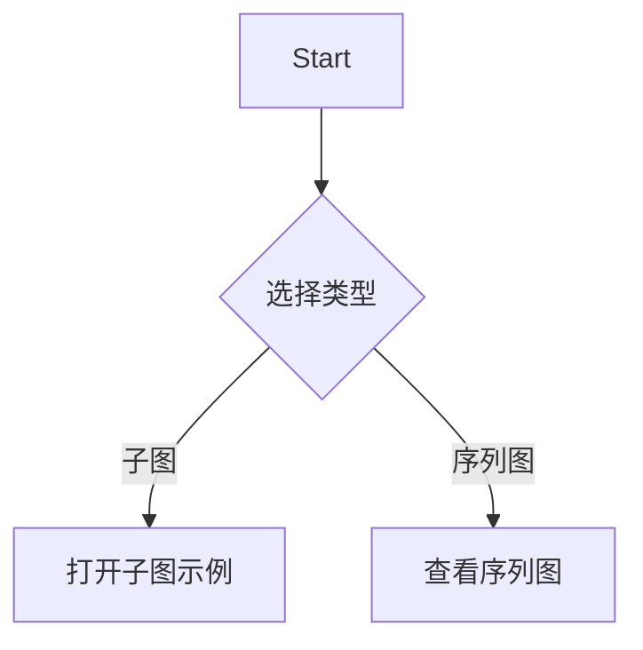

# Merfolk - Minimal Mermaid Extension

一个极简的 Mermaid 图表预览 VSCode 扩展，去除了官方插件中的冗余功能。

## 功能特性

- ✅ 基础的 Mermaid 图表预览
- ✅ 支持 `.mmd` 和 `.mermaid` 文件
- ✅ 语法高亮
- ✅ 实时预览更新
- ✅ **MermaidLocal 链接支持** - 可以在不同 Mermaid 文件间导航
- ✅ **可配置的预览打开位置** - 自定义预览面板的默认打开位置

## MermaidLocal 链接功能

使用 `MermaidLocal:` 前缀来创建指向其他本地 Mermaid 文件的链接：



路径解析类似于 Markdown，支持相对路径引用。

## 使用方法

1. 打开 `.mmd` 或 `.mermaid` 文件
2. 使用以下任一方式打开预览：
   - 按 `Ctrl+Shift+V` (Windows/Linux) 或 `Cmd+Shift+V` (Mac)
   - 点击编辑器标题栏的预览图标
   - 从命令面板选择 "Mermaid: Open Preview"

### 配置选项

可以通过 VSCode 设置自定义预览行为：

#### 预览位置配置

1. **Mermaid 文件预览位置** (`merfolk.preview.defaultColumn`)
   - `beside` (默认): 在当前编辑器旁边的列中打开
   - `right`: 在最右侧列中打开
   - `left`: 在最左侧列中打开
   - `active`: 在当前编辑器列中打开
   - `one`: 在第一列中打开
   - `two`: 在第二列中打开
   - `three`: 在第三列中打开

2. **内联预览位置** (`merfolk.inlinePreview.defaultColumn`)
   - `right` (默认): 在最右侧列中打开
   - `beside`: 在当前编辑器旁边的列中打开
   - `left`: 在最左侧列中打开
   - `active`: 在当前编辑器列中打开
   - `one`: 在第一列中打开
   - `two`: 在第二列中打开
   - `three`: 在第三列中打开

在 VSCode 设置中搜索 "merfolk" 即可找到这些配置选项。

## 安装

### 从 VSIX 安装

1. 运行 `just package-vsix` 生成 VSIX 文件
2. 在 VSCode 中：命令面板 > Extensions: Install from VSIX
3. 选择生成的 VSIX 文件

## 移除的功能

相比官方 Mermaid 插件，本扩展移除了以下功能以保持轻量：

- ❌ AI 功能和聊天集成
- ❌ 云同步服务
- ❌ 团队协作功能
- ❌ 导出功能 (SVG/PNG)
- ❌ Markdown 集成
- ❌ 复杂的 UI 框架
- ❌ 高级缩放/平移控制
- ❌ 外部服务依赖

## 开发

```bash
# 安装依赖
pnpm install

# 编译
pnpm run compile

# 打包 VSIX
just package-vsix

# 开发模式（按 F5）
# 在 VSCode 中打开扩展开发主机进行测试
```

## 许可证

MIT