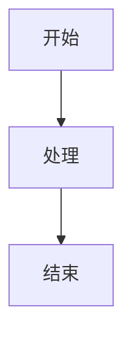

<div align="center">
  

  <h1>Merfolk</h1>

  <p>
    <a href="https://github.com/straydragon/vscode-merfolk/actions/workflows/test.yml">
      
    </a>
    <a href="https://github.com/straydragon/vscode-merfolk/actions/workflows/release.yml">
      
    </a>
    <a href="https://open-vsx.org/extension/l8ng/vscode-merfolk"></a>
  </p>
</div>

## 功能介绍

Merfolk 是一个轻量级的 Mermaid 功能增强的 VS Code 插件，让你在编辑器中直接预览和导航 Mermaid 图表。

### 实时预览图表

插件会在 VS Code 中创建一个专门的预览面板，显示当前打开的 `.mmd` 或 `.mermaid` 文件的图表。预览面板支持：

- 缩放功能：可以放大或缩小图表，方便查看大型图表的细节
- 平移功能：按住鼠标左键拖动，可以在预览中移动图表位置
- 自适应屏幕：自动调整图表大小以适应预览面板
- 实时更新：当你在编辑器中修改图表代码时，预览会自动刷新

预览面板默认在当前编辑器的旁边打开，你也可以在设置中配置它在其他位置显示。

### 跨文件图表导航

在任何类型的文件中，你都可以插入特殊格式的链接来引用 Mermaid 图表：

#### 支持的语法

**引用 .mmd 文件：**
```
[MermaidChart: path/to/diagram.mmd]
```

**引用 Markdown 文件中的图表：**
```markdown
<!-- 在你的 markdown 文件中标记 mermaid 块 -->
<!-- merfolk@arch1 -->


```
<!-- 在其他文件中引用 -->
[MermaidChart: docs/architecture.md@arch1]
```

#### 如何使用

1. **标记 Mermaid 块**：在 Markdown 文件中的 mermaid 代码块前添加 `<!-- merfolk@<id> -->` 注释
2. **引用图表**：使用 `[MermaidChart: path/to/file.md@<id>]` 语法引用标记的图表

插件会自动识别这种格式，并在链接旁边显示两个操作按钮：

- **Preview 按钮**：点击后在预览面板中查看图表
- **Open 按钮**：点击后打开图表文件（对于 Markdown 文件会导航到对应章节）

这种方式让你可以在文档、代码或其他文件中轻松引用和查看相关的流程图、架构图等。链接路径支持相对路径和绝对路径，插件会自动解析文件位置。

### Markdown 代码块预览

在 Markdown 文件的 <code>```mermaid</code> 代码块顶部会显示 **Preview** CodeLens，可一键预览单个 Mermaid 代码块内容，适合在长文档里快速查看某一段图表。

### 图表导出

预览面板提供了导出功能，可以将当前显示的图表保存为 SVG 格式的文件。导出的 SVG 文件可以在其他应用程序中使用或进一步编辑。

### 语法高亮

插件为 `.mmd` 和 `.mermaid` 文件提供完整的语法高亮，让图表代码更易读易懂。

## 配置选项

插件提供以下配置选项，可以通过 VS Code 设置进行自定义：

- **merfolk.preview.defaultColumn**: 控制预览面板默认打开的位置
  - `beside`: 在当前编辑器旁边（默认）
  - `right`: 在最右侧列
  - `left`: 在最左侧列
  - `active`: 在当前编辑器列
  - `one/two/three`: 在指定列

## 工作原理

当你打开一个 Mermaid 文件时，插件会在预览面板中加载 Mermaid.js 渲染引擎，将你的图表代码转换为可交互的可视化图表。对于包含 `[MermaidChart:]` 链接的文件，插件会扫描整个文档并添加相应的操作按钮。

预览面板使用 WebView 技术实现，与 VS Code 主界面集成，提供流畅的用户体验。所有图表渲染都在本地进行，不依赖外部服务。
