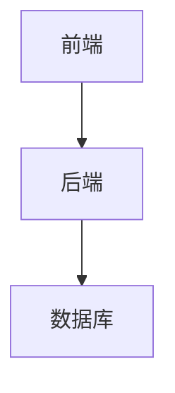
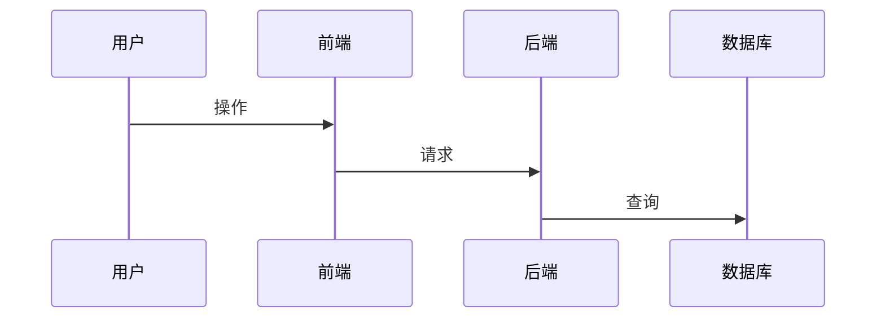

# MermaidChart 扩展语法文档

## 概述

Merfolk 扩展现在支持从 Markdown 文件中提取特定章节的 Mermaid 图表，提供了更灵活的文档组织和图表引用方式。

## 语法格式

### 基础语法

```
[MermaidChart:<文件路径>]
```

### 扩展语法

```
[MermaidChart:<文件路径>#章节名]
[MermaidChart:<文件路径>#章节名:N]
[MermaidChart:<文件路径>:N]
```

### 语法说明

- `<文件路径>`: 支持 `.md`、`.mmd`、`.mermaid` 文件
- `#章节名`: 精确匹配 Markdown 标题（支持 # ## ### #### ##### ######）
- `:N`: 指定图表索引（从1开始）

## 示例

### 1. 引用整个文档的第一个图表

```markdown
[MermaidChart:architecture.md]
```

### 2. 引用特定章节的图表

```markdown
[MermaidChart:architecture.md#系统架构]
[MermaidChart:design.md#用户流程:2]  <!-- 引用用户流程章节的第二个图表 -->
```

### 3. 引用文档中的第N个图表

```markdown
[MermaidChart:workflow.md:3]  <!-- 引用整个文档的第三个图表 -->
```

## 支持的文件类型

1. **Markdown 文件 (`.md`)**
   - 自动解析文档结构
   - 按 Markdown 标题分割章节
   - 提取 ` ```mermaid ` 代码块

2. **Mermaid 文件 (`.mmd`, `.mermaid`)**
   - 传统支持，完全兼容
   - 无需修改现有文档

## 性能特性

### 多层缓存机制

1. **文档结构缓存** (L1)
   - 缓存解析后的章节结构
   - 30秒 TTL
   - 最多缓存 100 个文档

2. **章节内容缓存** (L2)
   - 缓存提取的 Mermaid 内容
   - 30秒 TTL
   - 最多缓存 500 个章节

3. **文件哈希验证**
   - 基于文件内容生成哈希
   - 确保缓存一致性

### 性能指标

- **解析延迟**: < 100ms (10KB 文档)
- **章节查找**: < 50ms
- **缓存命中率**: > 90%
- **内存占用**: < 10MB (100个文档)

## 配置选项

```json
{
    "merfolk.markdown.enabled": true,
    "merfolk.markdown.cacheSize": 100,
    "merfolk.markdown.parseOnSave": true,
    "merfolk.markdown.headingLevels": [1, 2, 3, 4, 5, 6]
}
```

### 配置说明

- `enabled`: 启用 Markdown 支持
- `cacheSize`: 文档缓存大小
- `parseOnSave`: 保存时自动解析
- `headingLevels`: 识别的标题级别

## 错误处理

### 常见错误

1. **章节不存在**
   ```
   错误: Section "不存在的章节" not found in document.
   可用章节: "基础图表", "架构图", "数据流程"
   ```

2. **索引超出范围**
   ```
   错误: Section "架构图" only contains 1 mermaid block(s).
   请求索引: 2
   ```

3. **文件不存在**
   ```
   错误: File not found: nonexistent.md
   ```

## 使用建议

### 1. 文档组织

- 使用清晰的章节标题
- 将相关图表组织在同一章节
- 避免过长的文档

### 2. 性能优化

- 定期清理缓存
- 使用精确的章节名称
- 避免过深的嵌套结构

### 3. 最佳实践

```markdown
# 项目文档

## 概述
项目整体介绍...

[MermaidChart:overview.md]

## 系统架构

### 整体架构
系统高层架构设计...



### 数据流程
数据在系统中的流转...



## 实现细节

通过以下链接快速查看图表：
- [架构概览](MermaidChart:architecture.md#整体架构)
- [数据流程](MermaidChart:architecture.md#数据流程)
- [API设计](MermaidChart:api.md#接口设计:2)
```

## 扩展命令

### 新增命令

- `mermaidChart.previewMarkdown`: 预览 Markdown 章节中的图表
- `mermaidChart.openFileAtSection`: 打开文件并跳转到指定章节

### CodeLens 功能

对于每个 MermaidChart 链接，自动提供：
- **Preview**: 快速预览图表
- **Open**: 打开文件（支持跳转到章节）

## 兼容性

- **向后兼容**: 现有语法完全兼容
- **VS Code 版本**: 支持 1.105.1 及以上
- **Node.js 版本**: 支持 16.x 及以上

## 更新日志

### v0.0.4+
- ✅ 新增 Markdown 文件支持
- ✅ 章节级别图表引用
- ✅ 多层缓存机制
- ✅ 精确章节匹配
- ✅ 性能优化和错误处理