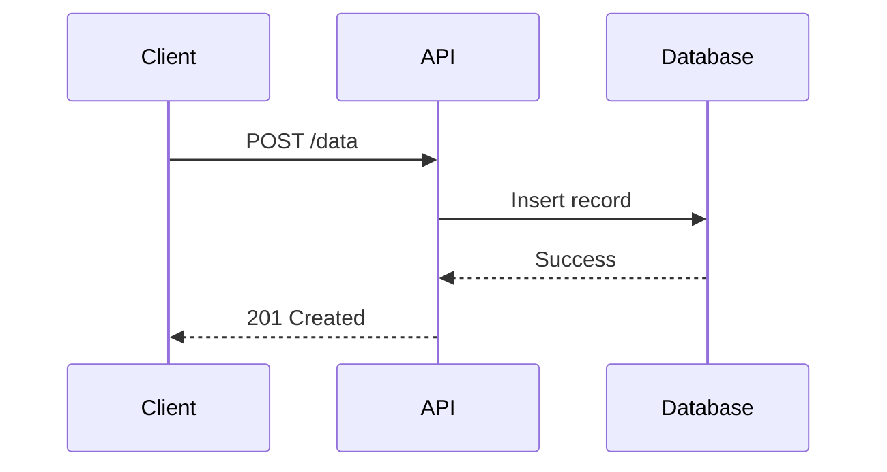
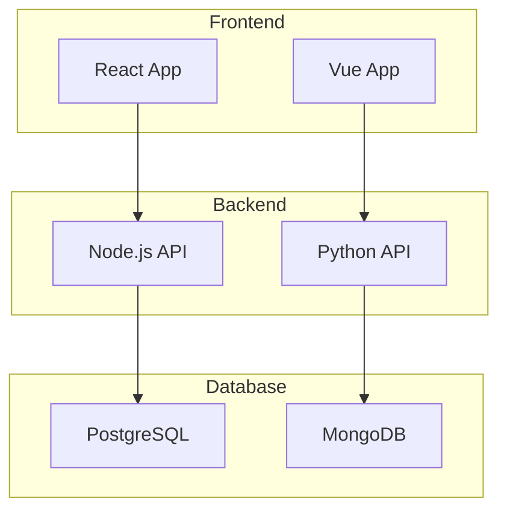

# Inline Mermaid Blocks with IDs

This example demonstrates using Mermaid diagrams within Markdown files with identifiable IDs for reference.

## First Diagram: User Login Flow

*Diagram ID: login-flow*

## Second Diagram: API Request Flow

*Diagram ID: api-flow*

## Third Diagram: System Architecture

*Diagram ID: system-arch*

## Referencing These Diagrams

To reference specific diagrams in this file:
- Use the MermaidChart syntax with file path and optional identifier
- The extension will scan the file for Mermaid blocks
- Each block can be accessed via its position or ID

Example reference from another file:
[MermaidChart:inline-mermaid-with-ids.md] - Will show the first diagram
[MermaidChart:inline-mermaid-with-ids.md#login-flow] - Will show the login flow diagram (if supported)