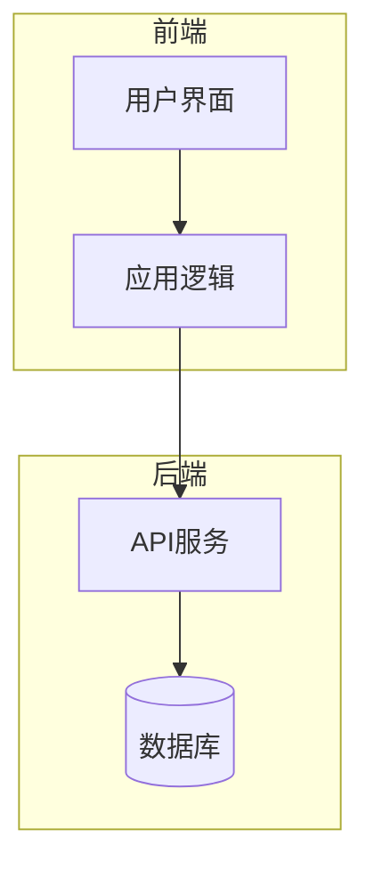
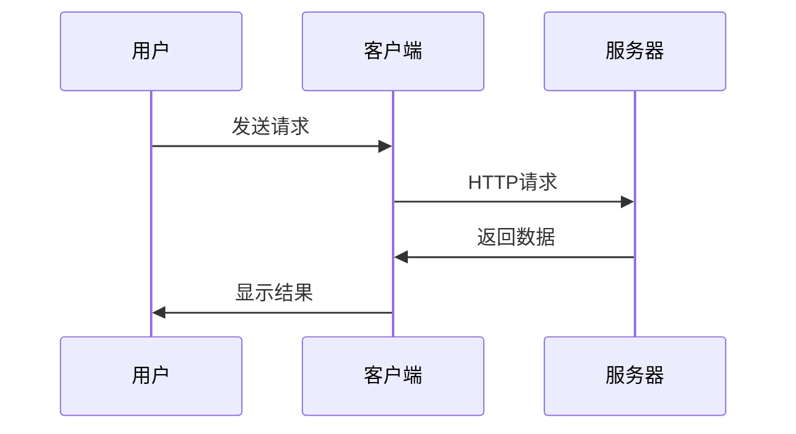

# MermaidChart 手动测试场景

这个文件包含了各种需要手动测试的场景，用于验证新语法的正确性。

## ✅ 正常场景

### 场景 1: 基础 .mmd 文件引用
[MermaidChart: ./basic-flowchart.mmd]
> 应该显示基础流程图预览按钮

### 场景 2: Markdown 文件 ID 引用

#### 架构图
<!-- merfolk@architecture -->

[MermaidChart: ./manual-test-scenarios.md@architecture]
> 应该显示架构图预览按钮

#### 数据流程
<!-- merfolk@dataflow -->

[MermaidChart: ./manual-test-scenarios.md@dataflow]
> 应该显示数据流程图预览按钮

### 场景 3: 相对路径引用
[MermaidChart: ./subfolder/diagram.mmd]
> 应该显示子文件夹中的图表

### 场景 4: 绝对路径引用（如果支持）
[MermaidChart: /absolute/path/to/diagram.mmd]
> 测试绝对路径（可能不支持）

## ❌ 错误场景

### 场景 5: Markdown 文件缺少 ID
[MermaidChart: ./manual-test-scenarios.md]
> 应该显示错误，提示需要 ID

### 场景 6: 不存在的 ID
[MermaidChart: ./manual-test-scenarios.md@nonexistent]
> 应该显示错误，并列出可用 ID

### 场景 7: 不存在的文件
[MermaidChart: ./nonexistent-file.md@test]
> 应该显示文件未找到错误

### 场景 8: 不支持的文件类型
[MermaidChart: ./test.txt@id]
> 应该显示文件类型不支持错误

## 🧪 边界场景

### 场景 9: 空的 Mermaid 图表
<!-- merfolk@empty -->
```mermaid

```
[MermaidChart: ./manual-test-scenarios.md@empty]
> 应该显示无内容错误

### 场景 10: 特殊字符 ID
<!-- merfolk@special-chars_test123 -->
```mermaid
graph LR
    A[开始] --> B[结束]
```
[MermaidChart: ./manual-test-scenarios.md@special-chars_test123]
> 应该支持特殊字符和数字

### 场景 11: 多个相同 ID
<!-- mermaid@duplicate -->

<!-- merfolk@duplicate -->

[MermaidChart: ./manual-test-scenarios.md@duplicate]
> 应该显示第一个匹配的图表

### 场景 12: ID 注释不在 mermaid 块前
<!-- merfolk@orphan -->
这个注释后面没有 mermaid 块
<!-- merfolk@valid -->

[MermaidChart: ./manual-test-scenarios.md@orphan]
> 应该显示找不到 ID 错误
[MermaidChart: ./manual-test-scenarios.md@valid]
> 应该正常显示

### 场景 13: 语法格式测试

#### 正确格式
[MermaidChart: ./manual-test-scenarios.md@architecture]
[MermaidChart: ./basic-flowchart.mmd]

#### 错误格式（不应该被识别）
[MermaidChart:./manual-test-scenarios.md@architecture]  <!-- 缺少空格 -->
[MermaidChart: manual-test-scenarios.md@architecture]  <!-- 缺少路径 -->
[ mermaidChart: ./manual-test-scenarios.md@architecture] <!-- 大小写错误 -->

## 📋 测试清单

### 功能测试
- [ ] 所有正常场景都能正确预览
- [ ] 错误场景显示友好的错误消息
- [ ] CodeLens 按钮正确显示
- [ ] Preview 和 Open 按钮都能工作

### 错误处理测试
- [ ] 缺少 ID 时显示可用 ID 列表
- [ ] 文件不存在时显示明确错误
- [ ] 不支持的文件类型有相应提示
- [ ] 空 mermaid 内容有错误提示

### 路径解析测试
- [ ] 相对路径正确解析
- [ ] 绝对路径处理（如果支持）
- [ ] 子文件夹引用正常
- [ ] 跨文件夹引用正常

### 性能测试
- [ ] 大文件处理（>100KB）
- [ ] 多个链接的文件
- [ ] 频繁切换预览

## 🚀 预期行为

1. **正常引用**：显示 Preview 和 Open 按钮，点击能正常预览
2. **错误处理**：显示详细错误信息，包含可用 ID 列表
3. **路径解析**：正确解析相对和绝对路径
4. **性能**：响应迅速，不卡顿

## 📝 注意事项

- 测试时注意观察错误消息是否友好
- 验证 CodeLens 按钮是否正确显示
- 检查预览面板内容是否正确
- 确认 Open 按钮能正确打开文件