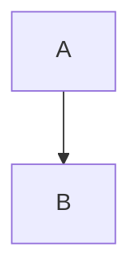
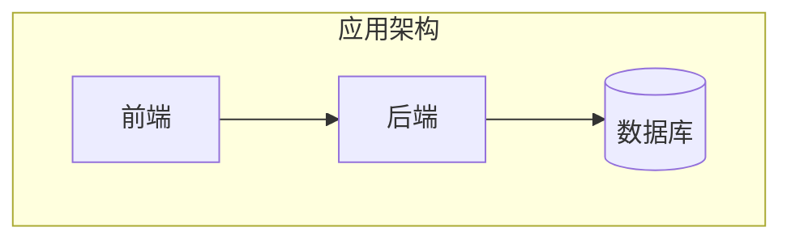
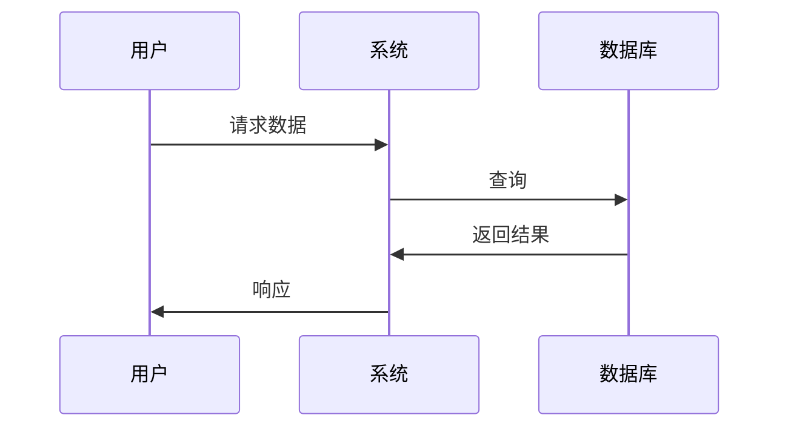
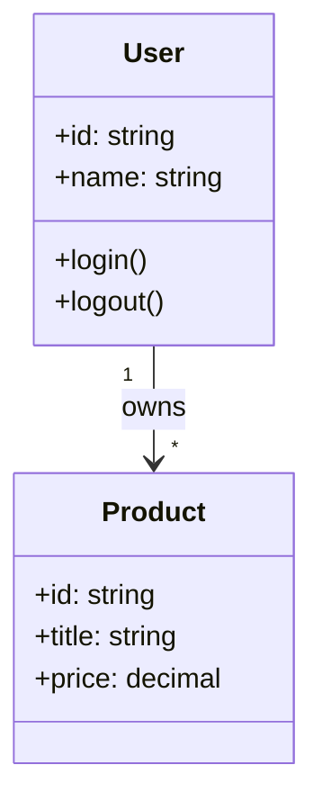
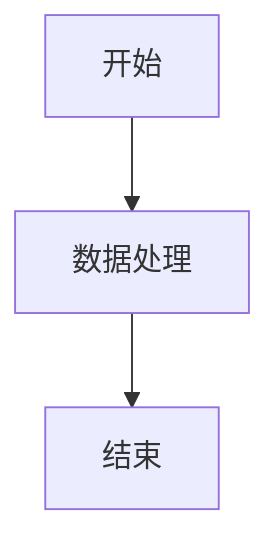

# 01-05: Markdown ID 语法测试

## 测试目标
验证新的 Markdown ID 语法功能是否正常工作。

## 语法格式
```markdown
<!-- 在 mermaid 块前添加注释 -->
<!-- merfolk@<ID> -->


<!-- 引用语法 -->
[MermaidChart: ./01-05-MarkdownID语法测试.md@<ID>]
```

## 测试用例

### 测试 1: 基础 ID 引用

#### 架构图
<!-- merfolk@architecture -->

[MermaidChart: ./01-05-MarkdownID语法测试.md@architecture]
> ✅ 预期: 正常显示架构图

### 测试 2: 数据流程图

<!-- merfolk@dataflow -->

[MermaidChart: ./01-05-MarkdownID语法测试.md@dataflow]
> ✅ 预期: 正常显示时序图

### 测试 3: 类图

<!-- merfolk@class-diagram -->

[MermaidChart: ./01-05-MarkdownID语法测试.md@class-diagram]
> ✅ 预期: 正常显示类图

### 测试 4: 特殊字符 ID

<!-- merfolk@special-id_123 -->

[MermaidChart: ./01-05-MarkdownID语法测试.md@special-id_123]
> ✅ 预期: 支持特殊字符

### 测试 5: 中文 ID

<!-- merfolk@中文图表 -->

[MermaidChart: ./01-05-MarkdownID语法测试.md@中文图表]
> ✅ 预期: 支持中文字符

## 📋 测试清单

- [ ] 所有 ID 引用都显示 CodeLens
- [ ] Preview 按钮能正确显示对应的 mermaid 图表
- [ ] Open 按钮能打开 Markdown 文件
- [ ] 支持特殊字符和数字
- [ ] 支持中文字符
- [ ] 多个 ID 在同一文件中正确识别

## 🎯 可用 ID 列表

当前文件定义的 ID：
- architecture
- dataflow
- class-diagram
- special-id_123
- 中文图表

## 🔍 关键验证点

1. **ID 识别**: 扩展能正确识别 `<!-- merfolk@id -->` 注释
2. **图表关联**: 每个 ID 关联到下一个 mermaid 代码块
3. **语法解析**: `[MermaidChart: file.md@id]` 语法正确解析
4. **错误处理**: 不存在的 ID 有友好提示（在错误测试中验证）

---

*测试完成标准: 所有 ID 引用都能正确预览对应的图表*