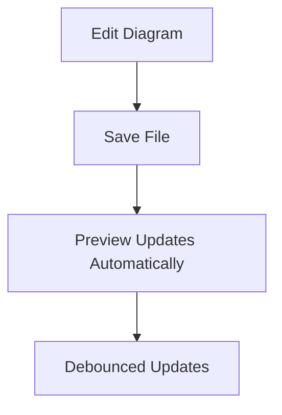
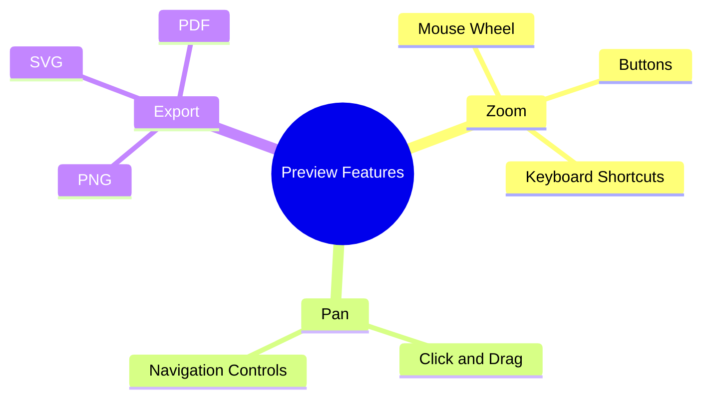
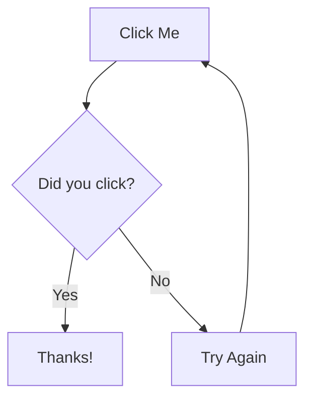
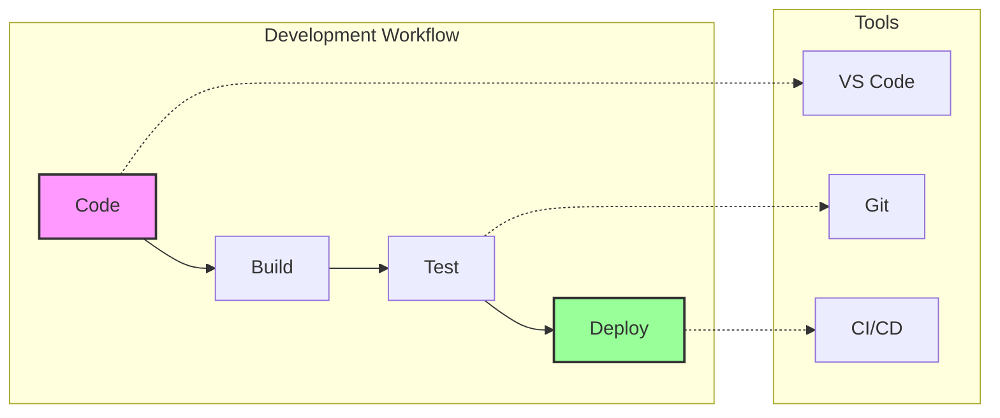

# Preview Panel Features

This file demonstrates the various features of the Merfolk preview panel.

## Open Preview

To open the preview panel:
- Use the command `Ctrl+Shift+V` (or `Cmd+Shift+V` on Mac)
- Or run the command: `Mermaid: Open Preview`

## Features Demonstrated

### 1. Auto-update

### 2. Zoom and Pan

### 3. Interactive Elements

### 4. Complex Diagram with Styling

## Preview Settings

Configure preview behavior in VS Code settings:
- `merfolk.preview.defaultColumn`: Controls where the preview opens
- Options: `beside`, `right`, `left`, `active`, `one`, `two`, `three`

## Keyboard Shortcuts in Preview

- `Ctrl++` (Cmd++): Zoom in
- `Ctrl+-` (Cmd+-): Zoom out
- `Ctrl+0` (Cmd+0): Reset zoom
- `Arrow Keys`: Pan the diagram
- `Escape`: Close preview