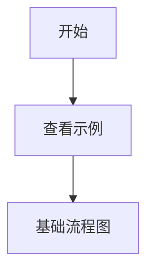

# Merfolk 示例集合

这个目录包含了各种 Mermaid 图表示例，展示了如何使用 Merfolk 扩展的不同功能。

## 目录结构

### 📁 basic/ - 基础图表示例
- **flowchart.mmd** - 基础流程图示例，展示条件判断和循环
- **sequence.mmd** - 序列图示例，展示用户登录流程
- **class-diagram.mmd** - 类图示例，简单的用户管理系统

### 📁 advanced/ - 高级图表示例
- **microservices.mmd** - 微服务架构图，包含多个服务层和数据层
- **state-machine.mmd** - 状态机图，订单处理流程，包含代码注释示例

### 📁 workflow/ - 工作流示例（重点展示 MermaidChart 链接）
- **index.mmd** - 示例导航主页，展示如何链接到其他 Mermaid 文件
- **ci-cd-pipeline.mmd** - CI/CD 流水线图，展示持续集成和部署流程
- **code-review.mmd** - 代码审查流程图，包含多个审查步骤

### 📁 architecture/ - 架构设计示例
- **system-design.mmd** - 系统架构设计图，分层架构展示
- **database-schema.mmd** - 数据库 ER 图，展示表关系和约束

## MermaidChart 链接功能

Merfolk 扩展支持 `MermaidChart:` 链接，允许在 Mermaid 图表中创建到其他本地文件的链接：



### 支持的链接格式：
1. **HTML 链接格式**（推荐）：`<a href="MermaidChart:path/to/file.mmd">链接文本</a>`
2. **即将支持**：
   - 注释格式：`// [MermaidChart:path/to/file.mmd]`
   - Python docstring：`"""示例 [MermaidChart:path/to/file.mmd] 说明"""`
   - JavaScript JSDoc：`/** 示例 [MermaidChart:path/to/file.mmd] 说明 */`

### 代码注释中的 MermaidChart 标记（规划中）：
```python
# [MermaidChart:diagrams/api-flow.mmd]
def process_api():
    """处理API请求 [MermaidChart:diagrams/api-states.mmd]"""
    pass
```

```javascript
// [MermaidChart:diagrams/component-flow.mmd]
function handleClick() {
    /**
     * 处理点击事件 [MermaidChart:diagrams/state-transitions.mmd]
     */
    console.log("clicked");
}
```

## 使用方法

1. 打开任意 `.mmd` 文件
2. 使用 `Ctrl+Shift+V` 打开预览
3. 点击 MermaidChart 链接跳转到相关文件
4. 扩展会自动在新文件中打开并更新预览

## 特色功能

- 🔄 **实时更新** - 文件修改后预览自动刷新
- 🔗 **文件导航** - 通过 MermaidChart 链接在不同图表间跳转
- 🎨 **语法高亮** - 支持 Mermaid 关键字高亮
- ⚡ **轻量快速** - 无外部依赖，启动快速