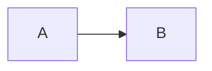
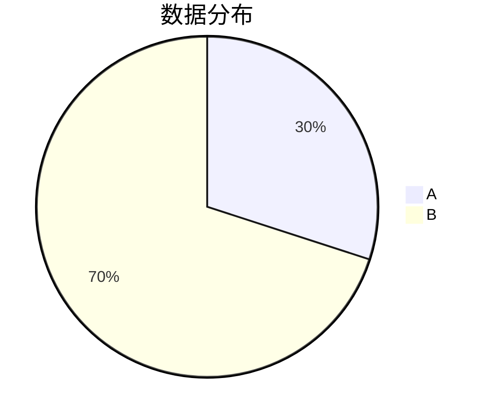
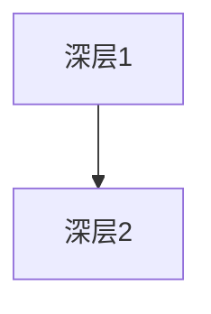
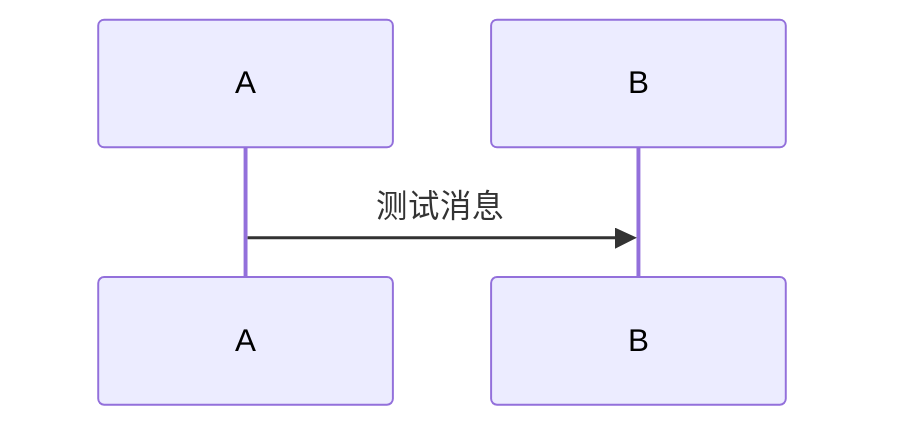
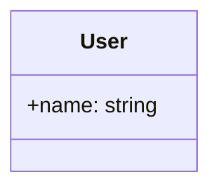
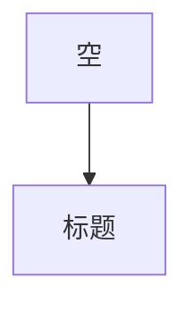
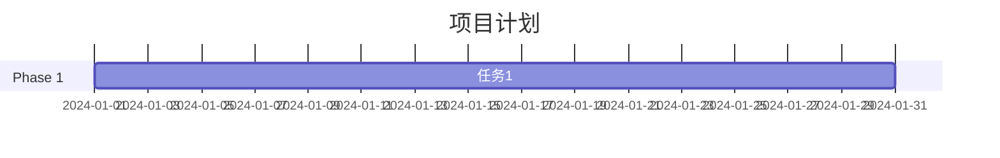
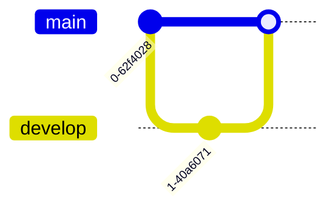
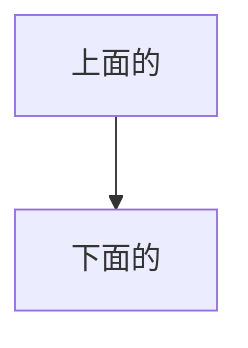

# 边界情况测试

这个文档用于测试各种边界情况和错误处理。

## 空章节测试

这个章节没有图表。

```markdown
# 这里是普通代码块，不是 mermaid
console.log("hello world");
```

## 单个图表章节



## 嵌套章节

### 子章节1



### 子章节2

没有图表的子章节。

#### 更深层的嵌套



## 特殊字符章节

### 包含特殊字符的标题 #@$%^&*()



### 包含括号的章节 (Test)



## 空白标题

#

这个章节的标题是空的。



## 编号标题

### 1. 第一个编号



### 2. 第二个编号

## 非常长的章节标题

这是一个非常非常非常长的章节标题，用来测试长标题的匹配和显示效果



## 连续代码块测试





## 测试链接

### 基础测试
- `[MermaidChart:edge-cases.md]` - 应该显示第一个图表（单个图表章节的）

### 章节测试
- `[MermaidChart:edge-cases.md#单个图表章节]` - 单个图表章节
- `[MermaidChart:edge-cases.md#嵌套章节]` - 嵌套章节（应该失败，因为没有直接图表）
- `[MermaidChart:edge-cases.md#子章节1]` - 子章节1
- `[MermaidChart:edge-cases.md#子章节2]` - 子章节2（应该失败，没有图表）
- `[MermaidChart:edge-cases.md#更深层的嵌套]` - 更深层嵌套

### 特殊字符测试
- `[MermaidChart:edge-cases.md#包含特殊字符的标题 #@$%^&*()]` - 特殊字符标题
- `[MermaidChart:edge-cases.md#包含括号的章节 (Test)]` - 包含括号的标题

### 索引测试
- `[MermaidChart:edge-cases.md:1]` - 第一个图表
- `[MermaidChart:edge-cases.md:2]` - 第二个图表
- `[MermaidChart:edge-cases.md:3]` - 第三个图表
- `[MermaidChart:edge-cases.md#连续代码块测试:2]` - 连续代码块中的第二个
- `[MermaidChart:edge-cases.md:99]` - 超出范围的索引（应该失败）

### 不存在的测试
- `[MermaidChart:edge-cases.md#不存在的章节]` - 不存在的章节
- `[MermaidChart:nonexistent.md]` - 不存在的文件

## 测试结果预期

1. **正常情况**: 应该正确显示对应的图表
2. **章节不存在**: 显示可用章节列表
3. **索引超出范围**: 显示该章节包含的图表数量
4. **文件不存在**: 显示文件未找到错误
5. **特殊字符**: 应该正确处理特殊字符
6. **嵌套结构**: 应该正确处理嵌套标题