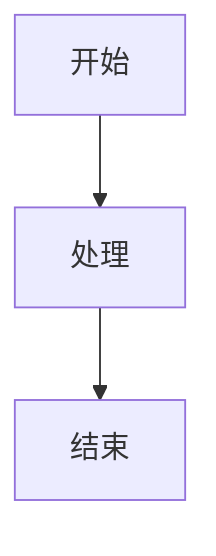
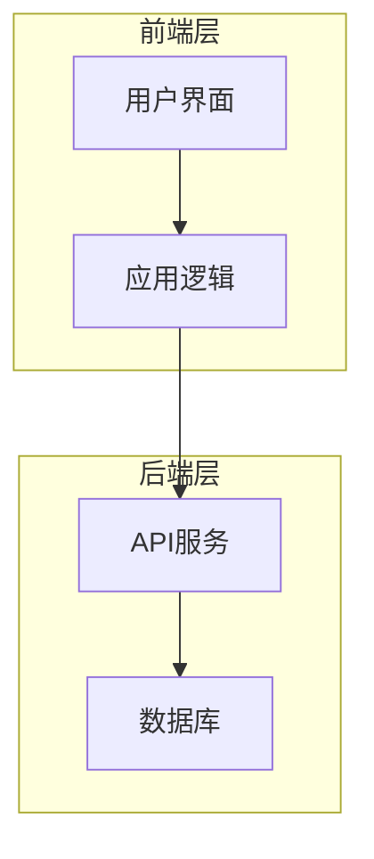
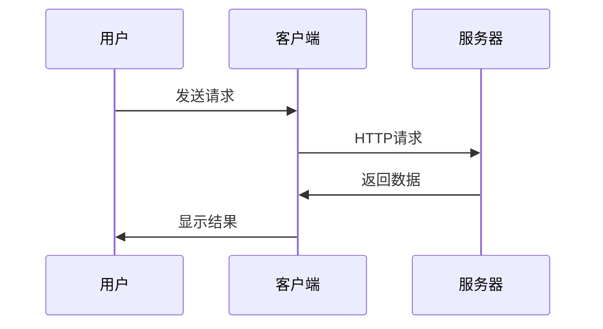
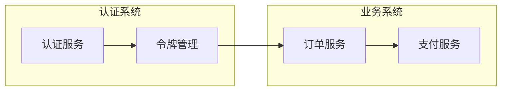
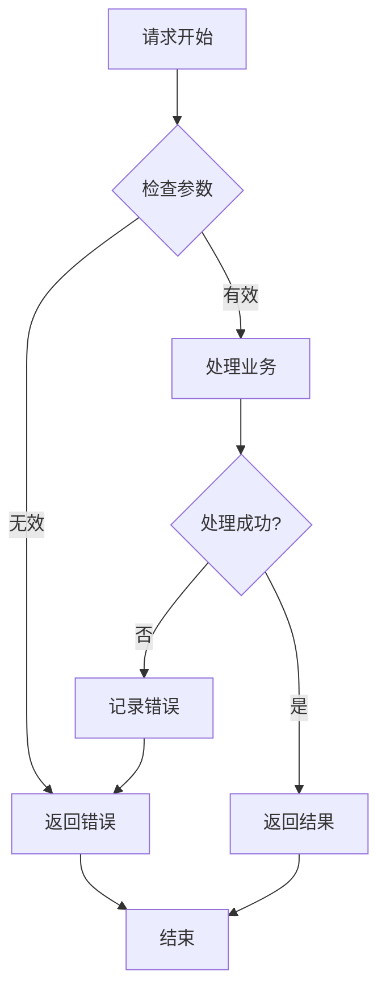

# MermaidChart 扩展语法测试

这个文档用于测试新的 `[MermaidChart:]` 扩展语法功能。

## 基础图表

这是一个基础的流程图：

## 架构图

系统架构设计图：

## 数据流程

## 测试链接

基础语法测试：

- `[MermaidChart:basic-flow.mmd]` - 引用普通mermaid文件
- `[MermaidChart:test-markdown-syntax.md]` - 引用整个markdown文档的第一个图表
- `[MermaidChart:test-markdown-syntax.md#架构图]` - 引用特定章节的图表
- `[MermaidChart:test-markdown-syntax.md#数据流程:1]` - 引用特定章节的第一个图表
- `[MermaidChart:test-markdown-syntax.md:2]` - 引用整个文档的第二个图表

## 复杂示例

### 子系统交互

### 错误处理流程

