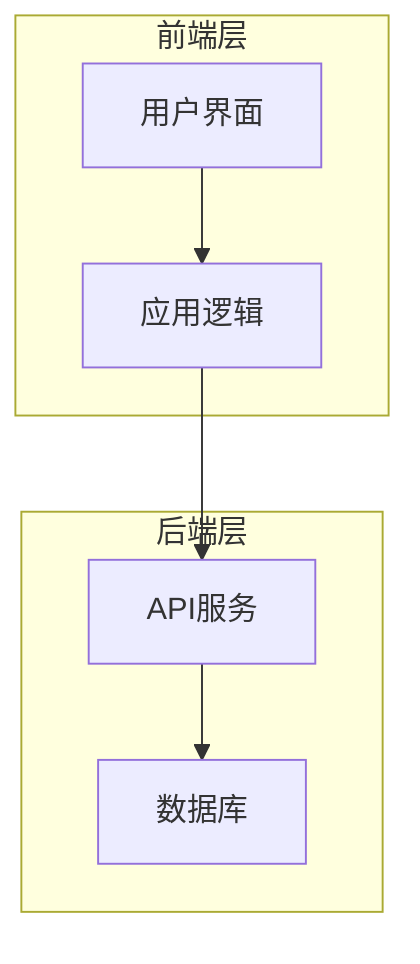
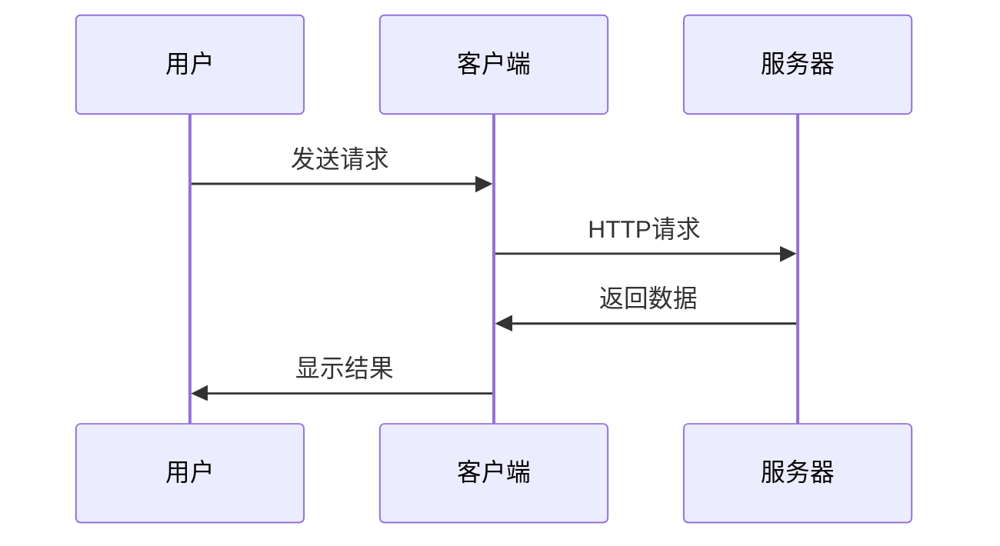
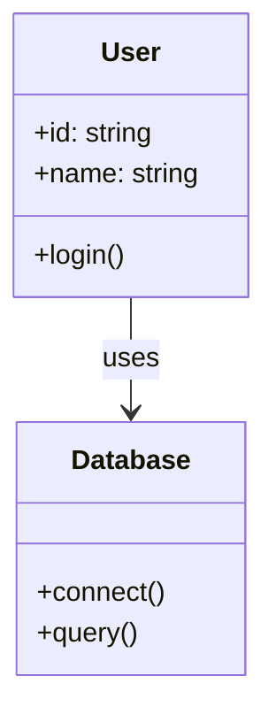

# MermaidChart 语法测试

这个文件用于测试新的 MermaidChart 语法。

## 架构图

<!-- merfolk@arch1 -->

## 数据流程

<!-- merfolk@pipeline -->

## 系统组件

<!-- merfolk@components -->

## 测试链接

测试链接语法：

- 传统 .mmd 文件：[MermaidChart: ./test-diagram.mmd]
- 带 ID 的 markdown 引用：[MermaidChart: ./test-syntax.md@arch1]
- 带 ID 的 markdown 引用：[MermaidChart: ./test-syntax.md@pipeline]
- 带 ID 的 markdown 引用：[MermaidChart: ./test-syntax.md@components]
- 错误的 ID 引用：[MermaidChart: ./test-syntax.md@nonexistent]
- 缺少 ID 的 markdown 引用：[MermaidChart: ./test-syntax.md]